# campusciff

//PRIMERA PARTE

Creamos repositorio--------------------------------------------------------------
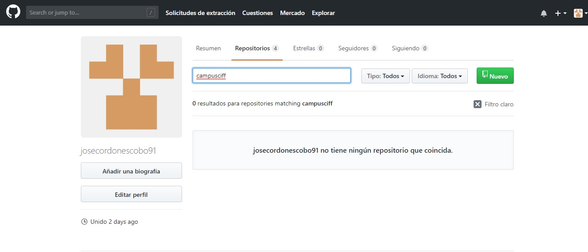

Comando git clone (creamos repositorio en nuestro local):------------------------
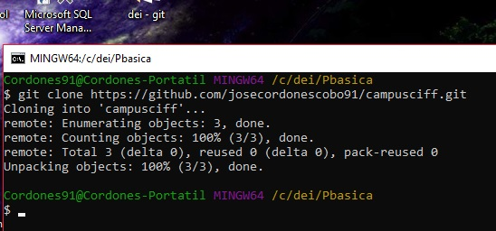

Fichero rename:------------------------------------------------------------------
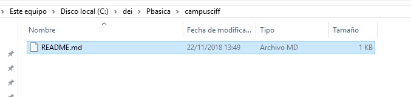

Commit y push con commit inicial:------------------------------------------------ 

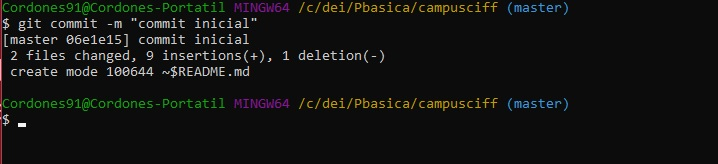

Creamos el fichero privado y la carpeta privada:---------------------------------
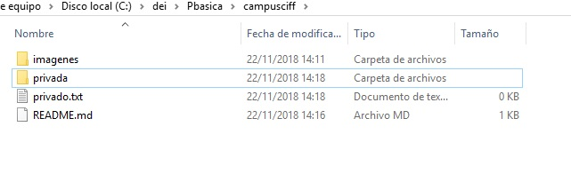

Creamos el .gitignore para ignorar el archivo y lacarpeta:-----------------------
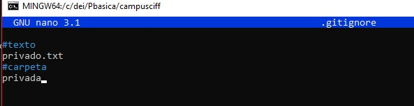
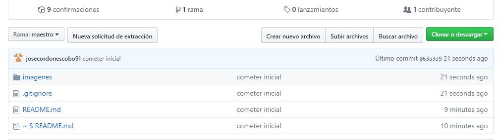

Creamos el archivo 1.txt:--------------------------------------------------------
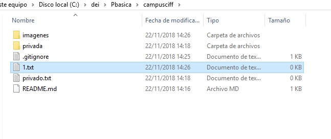

Creamos un tag:------------------------------------------------------------------
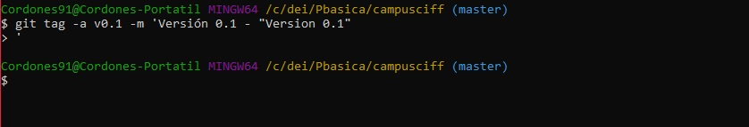

Subimos los cambios: ------------------------------------------------------------
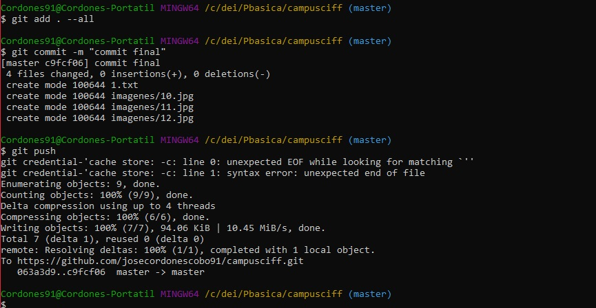
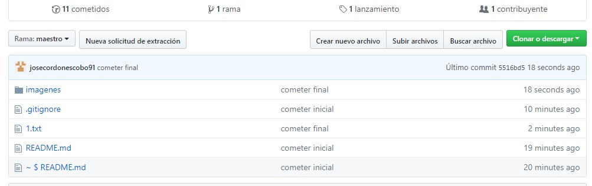

Cuenta(cambiarfoto):------------------------------------------------------------- 
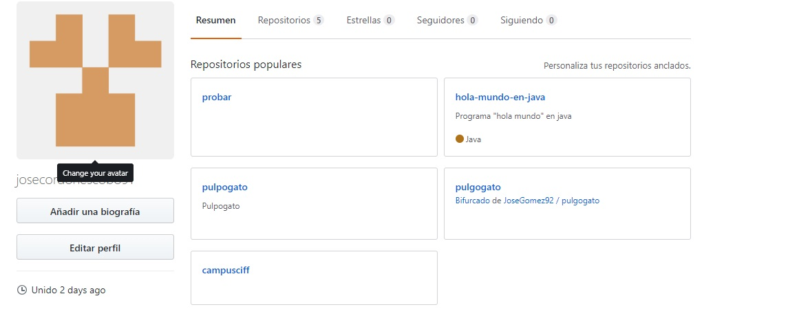

Tabla:---------------------------------------------------------------------------
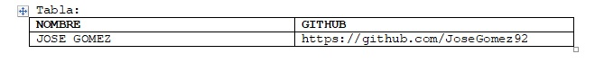

//SEGUNDA PARTE:

Crear rama(v02 y también cree vprueba):------------------------------------------ 
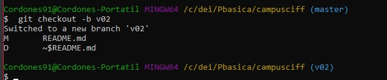

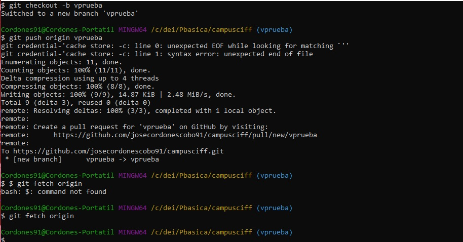

Nos posicionamos en la v02:------------------------------------------------------
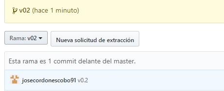
Creamos y subimos el fichero 2.txt:----------------------------------------------

Hacemos un merge:----------------------------------------------------------------
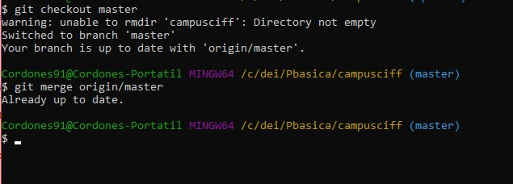

En 1.txt en la rama master ponemos hola y hacemos un commit:---------------------
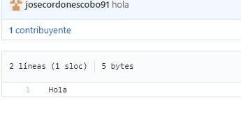

En la rama v02, en el fichero 1.txt ponemos algo y hacemos commit:---------------

Listamos las ramas:--------------------------------------------------------------
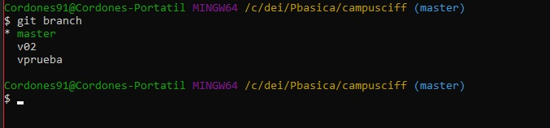

Creamos un tag:------------------------------------------------------------------
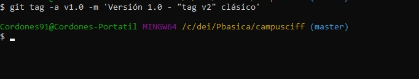

Borramos la rama v02:------------------------------------------------------------
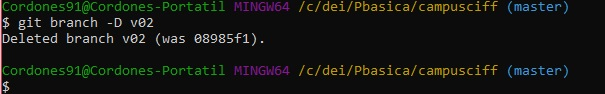

Listamos tag:--------------------------------------------------------------------
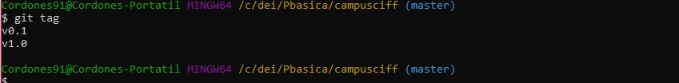

