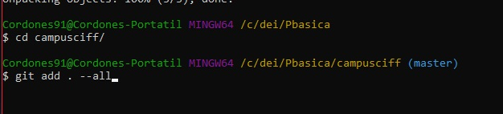
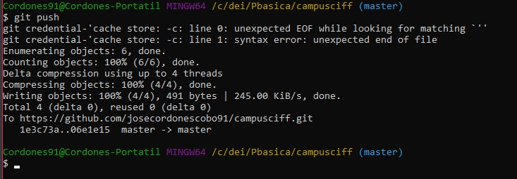
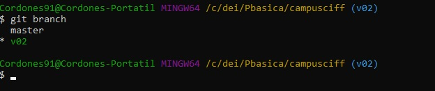
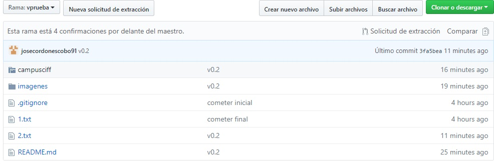
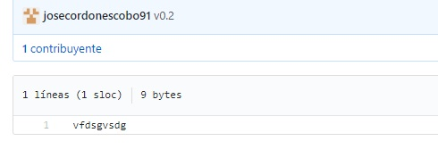

# campusciff

//PRIMERA PARTE

Creamos repositorio--------------------------------------------------------------

Comando git clone (creamos repositorio en nuestro local):------------------------

Fichero rename:------------------------------------------------------------------

Commit y push con commit inicial:------------------------------------------------ 

Creamos el fichero privado y la carpeta privada:---------------------------------

Creamos el .gitignore para ignorar el archivo y lacarpeta:-----------------------

Creamos el archivo 1.txt:--------------------------------------------------------

Creamos un tag:------------------------------------------------------------------

Subimos los cambios: ------------------------------------------------------------

Cuenta(cambiarfoto):------------------------------------------------------------- 

Tabla:---------------------------------------------------------------------------

//SEGUNDA PARTE:

Crear rama(v02 y también cree vprueba):------------------------------------------ 

Nos posicionamos en la v02:------------------------------------------------------

Creamos y subimos el fichero 2.txt:----------------------------------------------

Hacemos un merge:----------------------------------------------------------------

En 1.txt en la rama master ponemos hola y hacemos un commit:---------------------

En la rama v02, en el fichero 1.txt ponemos algo y hacemos commit:---------------

Listamos las ramas:--------------------------------------------------------------

Creamos un tag:------------------------------------------------------------------

Borramos la rama v02:------------------------------------------------------------

Listamos tag:--------------------------------------------------------------------

